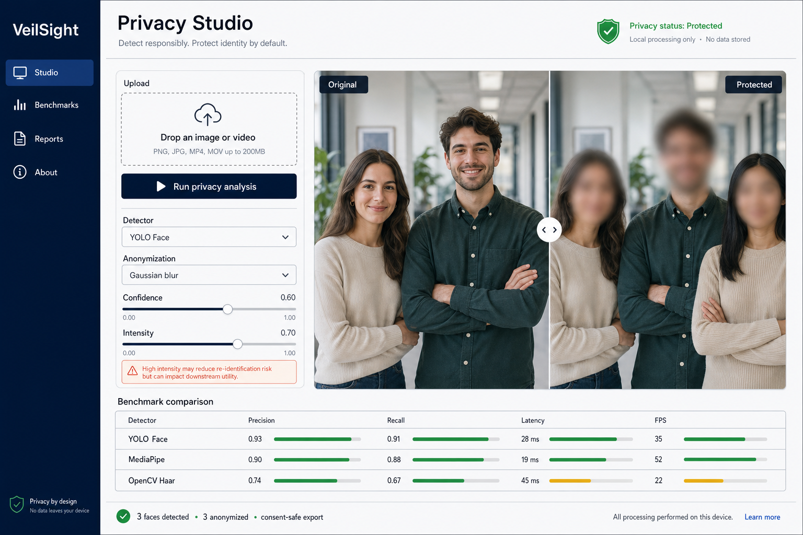

# VeilSight

VeilSight is a local-first face detection, anonymization, and benchmarking platform. It began with a small frustration: most face-detection demos celebrate finding a face, then quietly ignore what happens to that person’s identity.

This project treats protection as part of the inference pipeline—not an afterthought.



## The meaningful use case

VeilSight is designed for a privacy-preserving operations question: *how busy is a campus entrance, clinic reception, or public-service queue, and is anonymization complete enough to share the footage?* It returns a face-visible occupancy proxy, a queue signal, detector agreement, and a privacy-coverage indicator while discarding source media. That makes it useful for capacity planning, safety reviews, and dataset release workflows without building an identity database.

It is deliberately not a surveillance system: the signal is not a person count, there is no tracking, and no recognition or biometric matching.

## What it does

- Detects faces with OpenCV Haar out of the box, with optional MediaPipe and YOLO-Face adapters.
- Protects faces with Gaussian blur, pixelation, or a solid privacy mask.
- Processes images and videos through a stateless local API.
- Removes audio from protected video exports because a voice can reveal identity too.
- Compares detector latency, FPS, face count, and cross-detector agreement.
- Produces operational insight: occupancy band, possible queue signal, face-area ratio, and privacy coverage.
- Calculates precision and recall only when labelled ground truth is available.
- Exports a media-free session report from the browser.
- Keeps source media out of databases, analytics, and logs.
- Includes upload-size guards, restrictive response headers, configurable CORS, and a security hardening checklist.

## A deliberate limitation

VeilSight does **face detection**, not face recognition. It never assigns a name, creates an embedding database, or tries to determine who someone is.

Blur and pixelation reduce identification risk but do not guarantee anonymity. For sensitive material, use the solid mask and review every frame. Read the [privacy and threat model](docs/PRIVACY.md) before treating this as a production system.

## Architecture

```text
Browser (React + Vite)
    │ multipart media; no tracking
    ▼
FastAPI service
    ├── Detector registry
    │   ├── OpenCV Haar (ready by default)
    │   ├── MediaPipe (optional)
    │   └── YOLO Face (optional local weight)
    ├── Anonymization pipeline
    ├── Honest benchmark runner
    └── Temporary video workspace → deleted after response
```

The implementation is intentionally modular: detector outputs become a common `FaceBox`, so anonymization and evaluation do not care which model produced it.

## Run locally

Requirements: Python 3.11+, Node 20+, and npm.

```bash
make setup
```

For the complete local detector stack (MediaPipe plus Ultralytics), use `make setup-full`. The first run is heavier and model licences must be reviewed before commercial use.

In terminal one:

```bash
make api
```

In terminal two:

```bash
make web
```

Open `http://localhost:5173`. The included fictional sample image is ready immediately. Your own images require the API to be running.

### If you see a blank white screen

Do not double-click `frontend/index.html` and do not use VS Code's Live Server for this React app. Those tools do not compile the JSX modules. Run the Vite server instead:

```bash
cd frontend
npm install
npm run dev
```

If you only want to inspect a production build, run `npm run build` followed by `npm run preview`. The Python API must run separately for real uploads; the bundled sample remains available in demo mode without it.

### Docker

```bash
docker compose up --build
```

Then open `http://localhost:8080`.

## Optional detectors

Haar is intentionally the zero-setup baseline. For the other adapters, see [models/README.md](models/README.md). The interface reports unavailable models honestly instead of silently falling back to another detector.

## Tests

```bash
make test
```

Tests cover non-mutation, bounding-box clipping, anonymization scope, IoU, and precision/recall matching. The GitHub workflow also builds the frontend.

## Repository guide

```text
backend/app/          API, detector adapters, video and privacy pipeline
backend/tests/        deterministic unit tests
frontend/src/         recruiter-facing product interface
notebooks/            exploration only; no native OpenCV windows
docs/                 architecture, evaluation, privacy and demo script
design/               accepted visual specification
models/               setup notes; weights are not committed
```

## Research questions

This can grow beyond a portfolio demo into a small applied research project:

1. How does face-detector recall change under low light, occlusion, profile pose, and distance?
2. What protection method gives the best privacy–utility trade-off for downstream action recognition?
3. How stable are latency and thermal performance across CPU, Apple Silicon, CUDA, and ONNX runtimes?
4. Can temporal tracking reduce video cost without allowing a face to appear unprotected between detections?

The evaluation plan is documented in [docs/EVALUATION.md](docs/EVALUATION.md).
The applied problem framing is documented in [docs/USE_CASE.md](docs/USE_CASE.md).

## Responsible use

Use media you own or have permission to process. Do not use VeilSight for surveillance, identity matching, or high-stakes decisions. A detector can miss faces; a visually blurred face may still be identifiable from context, clothing, voice, or metadata.

## Portfolio walkthrough

A concise recruiter-friendly video script is included in [docs/WALKTHROUGH.md](docs/WALKTHROUGH.md). It focuses on the engineering decisions, limitations, and evidence instead of reading the UI aloud.

## License

Project code is available under the [MIT License](LICENSE). Model weights and datasets keep their original licences; check them separately before distribution or commercial use.
